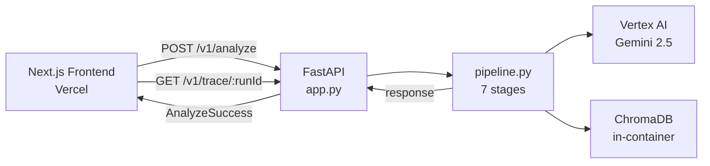
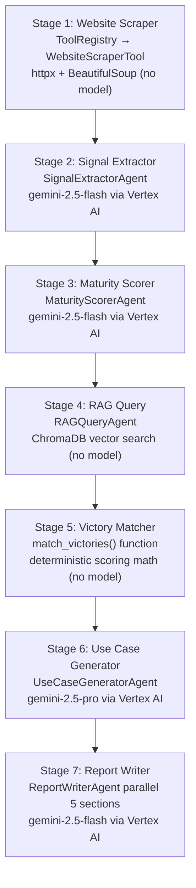

# Architecture

How the system fits together. Updated 2026-03-17.

---

## High-Level Overview

Two main pieces: a Next.js frontend and a FastAPI backend.

The frontend sends a company URL to `POST /v1/analyze`. The backend runs a
7-stage pipeline and returns a structured report. The frontend renders it.



The backend also exposes `GET /v1/trace/{run_id}` so the frontend can fetch
per-run log entries and display them in a trace panel.

---

## Pipeline Flow

Seven stages run in sequence inside `orchestrator/pipeline.py`.
Each stage writes its output into `PipelineState` and passes it to the next.



### Stage 1: Website Scraper

- Call: `registry.get("website_scraper").run({"url": url})`
- Tool: `WebsiteScraperTool` in `tools/website_scraper.py`, wraps `agents/scraper.py`
- Model: none - uses httpx and BeautifulSoup
- Output: `company_data` dict with `about_text`, `product_text`, `careers_text`, `job_postings`
- Gate: `scraper_quality_gate()` checks word count and error page signals before Stage 2

### Stage 2: Signal Extractor

- Agent: `SignalExtractorAgent`
- Model: gemini-2.5-flash via Vertex AI
- Input: `company_data`
- Output: `SignalSet` - list of typed signals with `signal_id`, `type`, `value`, `raw_quote`, `source`
- Validator: `validate_signals()` assigns IDs and sets confidence level

### Stage 3: Maturity Scorer

- Agent: `MaturityScorerAgent`
- Model: gemini-2.5-flash via Vertex AI
- Input: signals
- Output: `MaturityResult` with `composite_score` (0-5), `composite_label`, and four `dimensions`
- Required dimensions: `data_infrastructure`, `ml_ai_capability`, `strategy_intent`, `operational_readiness`
- Validator: `validate_maturity()` checks all four dimensions are present

### Stage 4: RAG Query

- Agent: `RAGQueryAgent`
- Model: none - ChromaDB vector search
- Input: `company_data`
- Output: list of matching past engagements from the vector store
- Store: `rag/vector_store.py` -> `ChromaStore` -> ChromaDB persisted at `./rag/store`

### Stage 5: Victory Matcher

- Function: `match_victories()` in `orchestrator/victory_matcher.py`
- Model: none - pure deterministic math
- Input: RAG results, industry, scale, maturity label, composite score
- Scoring: `industry_score` (0-0.4) + `maturity_score` (0-0.4) + `size_score` (0-0.2)
- Tiers: `DIRECT_MATCH` (score >= 0.7, industry match > 0), `CALIBRATION_MATCH` (>= 0.4), `ADJACENT_MATCH` (below 0.4)
- Output: sorted list of `VictoryMatch` objects

### Stage 6: Use Case Generator

- Agent: `UseCaseGeneratorAgent`
- Model: gemini-2.5-pro via Vertex AI
- Input: signals, maturity, victory matches
- Output: list of `UseCase` objects with tier, evidence signal IDs, ROI estimate, data flow
- Tiers: `LOW_HANGING_FRUIT`, `MEDIUM_SOLUTION`, `HARD_EXPERIMENT`
- Validator: `validate_use_cases()` requires at least 2 use cases

### Stage 7: Report Writer

- Agent: `ReportWriterAgent`
- Model: gemini-2.5-flash via Vertex AI
- Parallelism: `ThreadPoolExecutor` with 3 workers, generates all 5 sections concurrently
- Sections: `exec_summary`, `current_state`, `use_cases`, `roadmap`, `roi_analysis`
- Timeout per section: 60 seconds
- Fallback: if parallel executor fails, retries with single `_run_with_timeout` call

---

## Quality Gates

Gates run between stages. They are deterministic - no model call.

| Gate | Location | When it runs |
|------|----------|-------------|
| Scraper quality gate | `orchestrator/gates.py` - `scraper_quality_gate()` | After Stage 1, before Stage 2 |
| Signal validator | `orchestrator/validators.py` - `validate_signals()` | After Stage 2 output |
| Maturity validator | `orchestrator/validators.py` - `validate_maturity()` | After Stage 3 output |
| Use case validator | `orchestrator/validators.py` - `validate_use_cases()` | After Stage 6 output |

If a gate fails, the pipeline returns a `PipelineState` with `status=FAILED`
and a structured `error` dict. The API maps `SCRAPE_THIN` to HTTP 422, all
other failures to HTTP 500.

---

## Abstraction Layers

Four abstractions prevent any stage from calling a provider directly.

### ModelClient - `ops/model_client.py`

Abstract base: `ModelClient.complete(prompt, system, model) -> str | AgentError`

| Implementation | When used |
|---------------|-----------|
| `VertexProvider` | `MODEL_PROVIDER=vertex` (default) |
| `MockProvider` | `DRY_RUN=true` - reads from `tests/fixtures/sample_analysis.json` |

Factory: `get_model_client()` reads `MODEL_PROVIDER` and `DRY_RUN` env vars.

### VectorStore - `rag/vector_store.py`

Abstract base: `VectorStore.add(docs)` and `VectorStore.query(text, k)`

| Implementation | When used |
|---------------|-----------|
| `ChromaStore` | `VECTOR_STORE=chroma` (default), persists to `./rag/store` |
| `MockStore` | `DRY_RUN=true` - reads from `tests/fixtures/rag_seeds/victories.json` |

Factory: `get_vector_store()` reads `VECTOR_STORE` and `DRY_RUN` env vars.

### DeployTarget - `infra/deploy_target.py`

Abstract base: `DeployTarget.deploy(image_uri)`, `get_service_url()`, `health_check()`

| Implementation | When used |
|---------------|-----------|
| `GCPCloudRunTarget` | `DEPLOY_TARGET=gcp` (default), uses `gcloud` CLI |

Factory: `get_deploy_target()` reads `DEPLOY_TARGET` env var.

### Tool / ToolRegistry - `orchestrator/tool_registry.py`

Abstract base: `Tool.run(input_data) -> dict | AgentError`

The `ToolRegistry` singleton holds all registered tools keyed by `tool_id`.
Pipeline stages call `registry.get("tool_id").run(input)` - they never
instantiate tool classes directly.

To add a new tool: create `tools/new_tool.py`, call `registry.register(NewTool())`.
No changes to `pipeline.py` needed.

| Tool ID | Implementation | Wraps |
|---------|---------------|-------|
| `website_scraper` | `tools/website_scraper.py` - `WebsiteScraperTool` | `agents/scraper.py` |

---

## Model Routing

Which stages make model calls and which are local.

| Stage | Agent / Function | Model | Provider | Makes model call |
|-------|-----------------|-------|----------|-----------------|
| Stage 1: Scraper | `WebsiteScraperTool` | none | httpx + BS4 | No |
| Stage 2: Signal Extractor | `SignalExtractorAgent` | gemini-2.5-flash | Vertex AI | Yes |
| Stage 3: Maturity Scorer | `MaturityScorerAgent` | gemini-2.5-flash | Vertex AI | Yes |
| Stage 4: RAG Query | `RAGQueryAgent` | none | ChromaDB | No |
| Stage 5: Victory Matcher | `match_victories()` | none | local math | No |
| Stage 6: Use Case Generator | `UseCaseGeneratorAgent` | gemini-2.5-pro | Vertex AI | Yes |
| Stage 7: Report Writer | `ReportWriterAgent` | gemini-2.5-flash | Vertex AI | Yes |
| Eval scoring | `JudgeClient` | gemini-2.5-pro | Vertex AI | Yes (evals only) |

Approximate pipeline cost per run: ~$0.011

---

## Infrastructure

| Component | Technology | Notes |
|-----------|------------|-------|
| API server | FastAPI, `app.py` at repo root | Cloud Run, us-central1 |
| Frontend | Next.js App Router | Vercel |
| LLM | Vertex AI Gemini | us-central1, GCP project: plotpointe |
| Vector store | ChromaDB | In-container, `./rag/store` |
| Eval judge | Vertex AI Gemini (gemini-2.5-pro) | Evals only, not in pipeline |
| Secrets | GCP Secret Manager | |
| Logs | `logs/runs/{run_id}.jsonl` | Written per run, never committed |

The FastAPI app is at `app.py` in the repo root. Not at `infra/app.py`.

Cloud Run config: 2Gi memory, 1 CPU, 0-3 instances, unauthenticated.

---

## Data Flow

Typed objects flow through `PipelineState` between stages.

```
url (string)
  -> Stage 1 -> company_data: dict { about_text, product_text, careers_text, job_postings }
  -> Stage 2 -> signals: SignalSet { signals: List[Signal], industry, scale, confidence_level }
  -> Stage 3 -> maturity: MaturityResult { dimensions, composite_score, composite_label }
  -> Stage 4 -> rag_context: List[dict]  (raw victory records from ChromaDB)
  -> Stage 5 -> victory_matches: List[VictoryMatch] { win_id, match_tier, similarity_score, gap_analysis }
  -> Stage 6 -> use_cases: List[UseCase] { tier, title, evidence_signal_ids, roi_estimate, data_flow }
  -> Stage 7 -> report: dict { exec_summary, current_state, use_cases, roadmap, roi_analysis }
```

All schemas defined in `orchestrator/schemas.py`:
`Signal`, `SignalSet`, `DimensionScore`, `MaturityResult`, `VictoryMatch`, `UseCase`, `DataFlow`

`PipelineState` in `orchestrator/state.py` holds all stage outputs plus metadata:
`run_id`, `status`, `cost_usd`, `elapsed_seconds`, `error`

---

## Logging

Logging is not a pipeline stage. It runs throughout every stage.

`ops/logger.py` provides `PipelineLogger` and `get_logger(run_id)`.

Each stage calls `logger.log_agent_call(tag, ...)` before and after its model call.
Entries append to `logs/runs/{run_id}.jsonl` - one JSONL file per run.

`GET /v1/trace/{run_id}` in `app.py` reads that file and returns all entries.
The frontend `TracePanel` component fetches and renders them.

---

## Eval System

Evals run separately from the pipeline - not part of production runs.

```
evals/ci_eval.py
  - reads evals/test_companies.json (5 test companies)
  - runs dry-run pipeline for each
  - scores top 3 use cases per company against 3 rubrics

evals/judge_client.py  (JudgeClient)
  - loads YAML rubric from evals/rubrics/
  - formats judge prompt from rubric template
  - calls gemini-2.5-pro via Vertex AI
  - parses "SCORE: N" pattern from response
  - returns float 1.0-5.0

Rubrics:
  - evals/rubrics/tier_classification.yaml
  - evals/rubrics/evidence_grounding.yaml
  - evals/rubrics/roi_basis.yaml

Results written to evals/baselines.json keyed by sprint name.
Pass threshold: 3.8 / 5.0
```

---

## Frontend

Next.js App Router with TypeScript and Tailwind CSS.

### Pages

| Route | File | Description |
|-------|------|-------------|
| `/` | `app/page.tsx` | Home page with URL input form |
| `/analysis/[runId]` | `app/analysis/[runId]/page.tsx` | Results page for a completed run |

### Components

| Component | Description |
|-----------|-------------|
| `URLInputForm` | URL text field and submit button |
| `AnalyzeForm` | Wraps form, calls `/v1/analyze`, redirects to results page on success |
| `PipelineProgress` | Animated progress indicator while pipeline runs |
| `ResultsView` | Full report rendering - entry point for the results page |
| `ReportCard` | Renders one report section |
| `ReportNav` | Sticky navigation bar for scrolling between report sections |
| `MaturityBadge` | Displays composite maturity score and label |
| `UseCaseCard` | One use case with tier, description, ROI, evidence |
| `UseCaseTierSection` | Groups use cases by tier |
| `EvidencePanel` | Shows raw signal quotes behind a finding |
| `TracePanel` | Fetches and renders pipeline trace log |
| `TraceStageRow` | One collapsible row in the trace panel |
| `ErrorMessage` | Error state display |

### API integration

The frontend calls `/v1/analyze` via `POST` and redirects to `/analysis/{runId}`
on success. The results page calls `GET /v1/trace/{runId}` to load the trace.
All API calls go to the URL set in `NEXT_PUBLIC_API_URL` env var.

---

## File Ownership

| Directory / File | Owner |
|-----------------|-------|
| `agents/*.py`, `orchestrator/*.py`, `tools/*.py`, `ops/*.py`, `rag/*.py`, `infra/*.py`, `app.py` | Backend |
| `evals/*.py`, `evals/rubrics/*.yaml`, `.github/workflows/*.yml` | QA |
| `prompts/*.md`, `docs/*.md`, `README.md` | PM |
| `frontend/**/*.ts`, `frontend/**/*.tsx` | Frontend |
